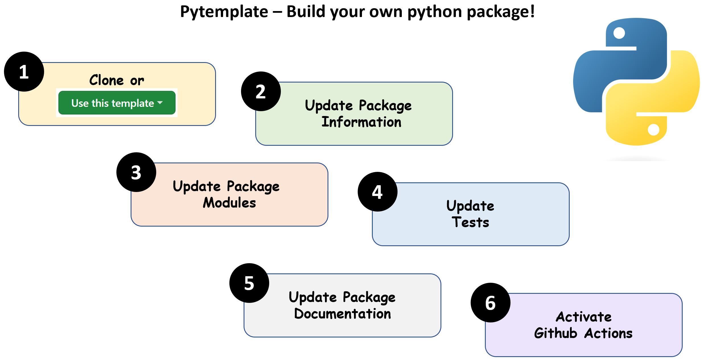
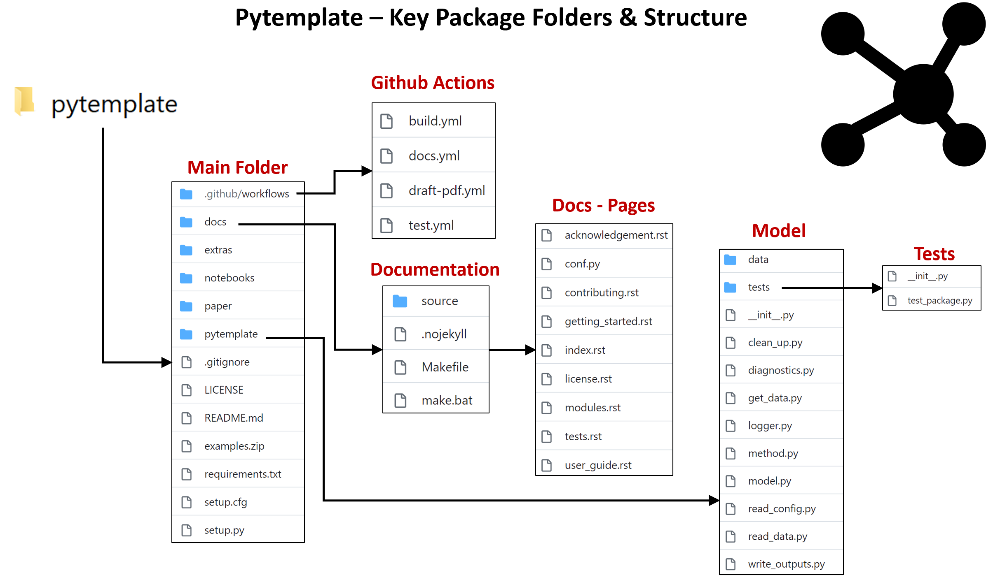

[](https://github.com/JGCRI/pytemplate/actions/workflows/build.yml)
[](https://github.com/JGCRI/pytemplate/actions/workflows/docs.yml)
[](https://github.com/JGCRI/pytemplate/actions/workflows/test.yml)
[](https://codecov.io/gh/JGCRI/pytemplate)

# Introduction

`pytemplate` is a template for creating a basic Python package with Continuous Integration (CI) via GitHub actions in the following steps:

<br>
<br>

[](https://raw.githubusercontent.com/JGCRI/pytemplate/dev/extras/pytemplate_build_your_own_package.png)

<br>
<br>

The folder structure is as shown below:

<br>
<br>

[](https://raw.githubusercontent.com/JGCRI/pytemplate/dev/extras/pytemplate_package_structure.png)

<br>
<br>

# 1 Clone or "Use this template"

Navigate directly to https://github.com/JGCRI/pytemplate, click the shiny green button that says `Use this template` and be on your way.

You can also clone the template to view the files locally and then copy into your own repo as needed:

```bash
git clone https://github.com/JGCRI/pytemplate.git
```

# 2 Update Package Information

Update your information (package name and other details) in the following files:

- README.md
- setup.py
- LICENSE
- pytemplate (Rename this folder to your new package name)

# 3 Update Package Modules

This is where you write the main code for your model. We have include some key modules and tests. You should write tests for all your modules as you develop them.

- pytemplate\model.py (This is your main model class. Update all module names as modules are updated)
- pytemplate\get_data.py (Update the path to your test data)
- pytemplate\read_config.py (Used to read a configuration file with model settings)
- pytemplate\read_data.py (Used to read data files for your model)
- pytemplate\method.py (This is where you do your main model operations. You can write multiple methods within this file or if you have many methods you can group them into separate files e.g. spatial_downscaling.py, temporal_downscaling.py)
- pytemplate\logger.py (This method starts the logger and is called in model.py. After this is loaded you can log all comments, errors and excution times throughout your code by using the logging module.)
- pytemplate\diagnsotics.py (Update this to write your diagnostic scripts that test how various modules are performing.)
- pytemplate\clean_up.py (Update this script to delete unecessary files, clean up memory and close out the model.)

# 4 Update Tests

We provide a sample test file that should be updated as you add in new modules and classes. These tests are linked to the GitHub Action so that everytime you push any changes your tests are executed. The GitHub action also links to codecoverage so that you know how much of your code is covered by the tests you have written. You should aim to keep this percentage to above 70%.

- pytemplate\tests\test_package.py (Update package and module names. Make sure to update tests as you new modules and classes)


# 5 Update Package Documentation

Update each of the following files to generate clean, clear documentation. When you push your changes to github the github actions described in the next section will automatically build the documentation page online for you. An example for this repo is available at: https://jgcri.github.io/pytemplate/. 

- docs\source\conf.py
- docs\source\contributing.rst
- docs\source\getting_started.rst
- docs\source\index.rst
- docs\source\license.rst
- docs\source\modules.rst
- docs\source\tests.rst
- docs\source\user_guide.rst

Once your GitHub action for docs is complete (see section 6 GitHub Actions) you need the following steps to get your documentation page live online:

<br>
<br>

[](https://raw.githubusercontent.com/JGCRI/pytemplate/dev/extras/pytemplate_activate_docs.png)

<br>
<br>

# 6 Github Actions

The final piece is to check your GitHub actions for continuous integration. These actions have been written so they are trigger everytime you push to main or execute a pull request to main. There are four GitHub actions included with this package as follows: 

- .github\workflows\build.yml (Tests if package builds on windows, macos, ubuntu)
- .github\workflows\docs.yml (Automatically builds you docs from the docs folder)
- .github\workflows\draft-pdf.yml (Automatically builds a JOSS version of a software paper from the paper folder. You can update paper.md file if you plan to publish your model.)
- .github\workflows\test.yml (Runs your tests and check what percentage is covered on codecov. You will need to connect your repository to codecoverage for this to work as shown below.)

<br>
<br>

[](https://raw.githubusercontent.com/JGCRI/pytemplate/dev/extras/pytemplate_codecov.png)

<br>
<br>

The final step is to add your badges to your repository as follows. Simply replace "pytemplate" with your own repo name in the following three badges and then paste these at the top of the README.md file and push:

```
[](https://github.com/JGCRI/pytemplate/actions/workflows/build.yml)
[](https://github.com/JGCRI/pytemplate/actions/workflows/docs.yml)
[](https://github.com/JGCRI/pytemplate/actions/workflows/test.yml)
```
For the codecoverage badge use the Markdown badge you copied from codecov as shown in the final step above.


